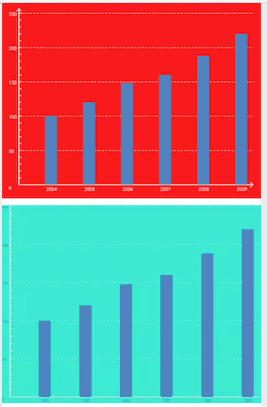
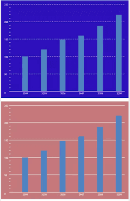
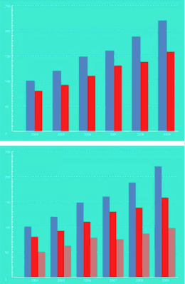
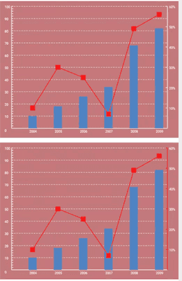
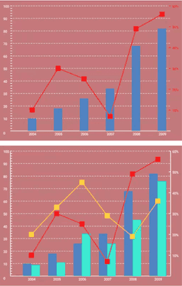

# diagramview显示图表的自定义view
- 最近无事，就写了一个竖状图以及连点成线图








## diagramview的使用
- xml下的使用
    ```
   <com.tqp.diagramview.DiagramView
            android:id="@+id/diagramView"
            android:layout_width="match_parent"
            android:layout_height="300dp"
            app:paddingLeft="@dimen/dp_10"
            app:paddingRight="@dimen/dp_10"
            app:paddingTop="@dimen/dp_10"
            app:paddingBottom="@dimen/dp_10"
            app:yAxisTextSize="20"
            app:xAxisTextSize="20"
            app:xAxisTextColor="@color/romance"
            app:yAxisTextColor="@color/romance"
            android:background="@color/lust"/>
    ```

- 代码中使用需要用到适配器
   ```
   DiagramView diagramView = findViewById(R.id.diagramView);
   ShuzhuangAdapter adapter = new ShuzhuangAdapter(getList());
   diagramView.setAdapter(adapter);
   ```
   这个getList是我随意使用的数据
   ```
   private List<XcellBean> getList(){
        List<XcellBean> beanList = new ArrayList<>();
        XcellBean xcellBean = new XcellBean("2004", 100);
        beanList.add(xcellBean);
        XcellBean xcellBean1 = new XcellBean("2005", 120);
        beanList.add(xcellBean1);
        XcellBean xcellBean2 = new XcellBean("2006", 148);
        beanList.add(xcellBean2);
        XcellBean xcellBean3 = new XcellBean("2007", 160);
        beanList.add(xcellBean3);
        XcellBean xcellBean4 = new XcellBean("2008", 188);
        beanList.add(xcellBean4);
        XcellBean xcellBean5 = new XcellBean("2009", 220);
        beanList.add(xcellBean5);
        return beanList;
    }
   ```
   XcellBean其实是随意的，这里面都有你自己定义
   ```
   public class XcellBean {
        private String nian;
        private float renkou;
        private float rate;

        public XcellBean(String nian, float renkou) {
            this.nian = nian;
            this.renkou = renkou;
        }

        public XcellBean(String nian, float renkou, float rate) {
            this.nian = nian;
            this.renkou = renkou;
            this.rate = rate;
        }

        public String getNian() {
            return nian;
        }

        public void setNian(String nian) {
            this.nian = nian;
        }

        public float getRenkou() {
            return renkou;
        }

        public void setRenkou(float renkou) {
            this.renkou = renkou;
        }

        public float getRate() {
            return rate;
        }

        public void setRate(float rate) {
            this.rate = rate;
        }
    }
   ```

- 这里就是适配器了
   ```
    private class ShuzhuangAdapter extends DiagramView.Adapter{

        private List<XcellBean> mBeanList;

        public ShuzhuangAdapter(List<XcellBean> beanList) {
            this.mBeanList = beanList;
        }

        @Override
        public int getAxleXColor() {
            return R.color.mystic;
        }

        @Override
        public int getAxleYColor() {
            return R.color.mystic;
        }

        @Override
        public int getItemCount() {
            return mBeanList.size();
        }

        @Override
        public int getYAxleBaseCellNum() {
            return 5;
        }

        @Override
        public int getYAxleBaseCell() {
            return 50;
        }

        @Override
        public String getYAxleBaseCellText(int position) {
            return 50 * (position + 1) + "";
        }

        @Override
        public int getYAxleBaseCellSegmentationNum() {
            return 5;
        }

        @Override
        public int getItemColor() {
            return R.color.havelock_blue;
        }

        @Override
        public String getXAxisText(int position) {
            return mBeanList.get(position).getNian();
        }

        @Override
        public float getItemWidth() {
            return 50f;
        }

        @Override
        public float getItemHigh(int position) {
            return mBeanList.get(position).getRenkou();
        }
    }
    ```

- 简书地址：https://www.jianshu.com/p/7adf341476f6
